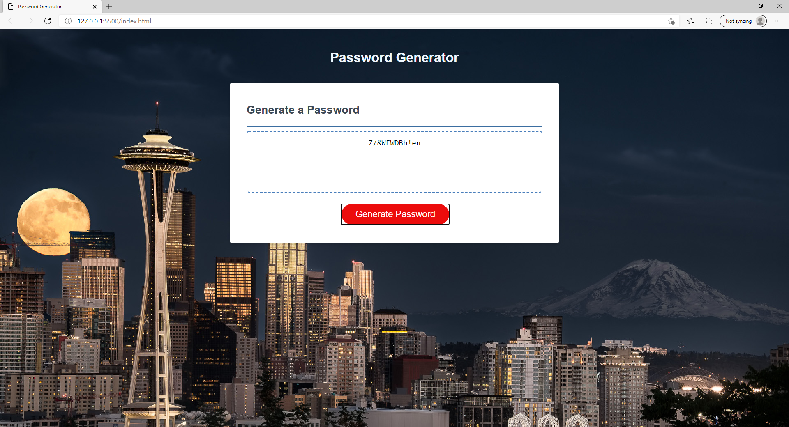

# 03 JavaScript: Password Generator

### Description of project
The aplication generates a random password based on user-selected criteria, and provides a strong password for greater security. 

### Aplication description:
Users are given couple options to select the password criteria, the user should choose the length of the password from the recommended range and at least one type of characters:
* Length range 8-128 characters
* List of characters type {lowercase; uppercase, numeric and/or special characters}.
random and is displayed on the screen.

### How to use?
- WHEN I click the button to generate a password
- THEN I am presented with a series of prompts for password criteria
- WHEN prompted for password criteria
- THEN I select which criteria to include in the password
- WHEN prompted for the length of the password
- THEN I choose a length of at least 8 characters and no more than 128 characters
- WHEN prompted for character types to include in the password
- THEN I choose lowercase, uppercase, numeric, and/or special characters
- WHEN I answer each prompt
- THEN my input should be validated and at least one character type should be selected
- WHEN all prompts are answered
- THEN a password is generated that matches the selected criteria
- WHEN the password is generated is displayed on the page

### Credits:
* https://www.w3schools.com/js/js_loop_for.asp
* https://www.w3schools.com/js/js_array_sort.asp
* https://www.w3schools.com/js/js_array_methods.asp
* https://www.w3schools.com/js/js_math.asp
* https://www.w3schools.com/js/js_random.asp
*

### Contributors:

* matachemarius92@gmail.com
* [Matache Marius](https://github.com/MatacheMarius)
### Directory:
* [Current Repository](https://github.com/MatacheMarius/H3_Password_Generator)
* [Website](https://matachemarius.github.io/H3_Password_Generator/)
